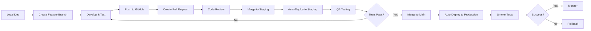
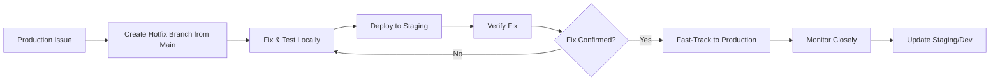
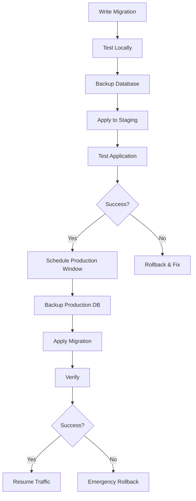

# Complete Deployment Strategy for E-commerce Platform

## 📋 Table of Contents
1. [Overview](#overview)
2. [Deployment Environments](#deployment-environments)
3. [Pre-Deployment Checklist](#pre-deployment-checklist)
4. [Deployment Workflows](#deployment-workflows)
5. [CI/CD Pipeline](#cicd-pipeline)
6. [Database Strategy](#database-strategy)
7. [Security & Secrets Management](#security--secrets-management)
8. [Monitoring & Observability](#monitoring--observability)
9. [Rollback Strategy](#rollback-strategy)
10. [Disaster Recovery](#disaster-recovery)
11. [Performance Optimization](#performance-optimization)
12. [Post-Deployment](#post-deployment)

---

## Overview

This document outlines the complete deployment strategy for the Ecoo e-commerce platform, built with:
- **Frontend/Backend**: Next.js 16 (App Router)
- **Database**: Supabase (PostgreSQL)
- **Hosting**: Vercel
- **Payments**: Razorpay
- **Emails**: Resend
- **Storage**: Supabase Storage

### Deployment Philosophy
- **Zero-downtime deployments**
- **Automated testing before production**
- **Database migrations are versioned and reversible**
- **Environment parity (dev/staging/prod)**
- **Security-first approach**

---

## Deployment Environments

### 1. Local Development
**Purpose**: Feature development and initial testing

```bash
# Setup
git clone <repository>
cd ecoo
npm install
cp .env.local.example .env.local
npm run dev
```

**Environment Variables**:
```env
NEXT_PUBLIC_SUPABASE_URL=http://localhost:54321
NEXT_PUBLIC_SUPABASE_ANON_KEY=local_anon_key
SUPABASE_SERVICE_ROLE_KEY=local_service_key
RAZORPAY_KEY_ID=test_key
RAZORPAY_KEY_SECRET=test_secret
NEXT_PUBLIC_RAZORPAY_KEY_ID=test_key
RESEND_API_KEY=test_resend_key
NEXT_PUBLIC_SITE_URL=http://localhost:3000
ADMIN_EMAIL=admin@localhost
WEBHOOK_SECRET=local_webhook_secret
```

### 2. Staging Environment
**Purpose**: Pre-production testing, client demos

**Infrastructure**:
- Vercel Preview Deployment (staging branch)
- Supabase Staging Project
- Razorpay Test Mode
- Resend Test Domain

**URL**: `https://ecoo-staging.vercel.app`

**Deployment Trigger**: Push to `staging` branch

### 3. Production Environment
**Purpose**: Live customer-facing application

**Infrastructure**:
- Vercel Production Deployment (main branch)
- Supabase Production Project
- Razorpay Live Mode
- Resend Verified Domain

**URL**: `https://yourdomain.com`

**Deployment Trigger**: Push to `main` branch (with approval)

---

## Pre-Deployment Checklist

### Code Quality
- [ ] All TypeScript errors resolved
- [ ] ESLint warnings addressed
- [ ] Unit tests passing (`npm run test`)
- [ ] E2E tests passing (`npm run test:e2e`)
- [ ] Code review completed
- [ ] No console.log or debug code
- [ ] Environment variables documented

### Database
- [ ] Migration scripts tested locally
- [ ] Backup of production database created
- [ ] Migration rollback script prepared
- [ ] RLS policies reviewed
- [ ] Indexes optimized
- [ ] Seed data prepared (if needed)

### Security
- [ ] Secrets rotated (if needed)
- [ ] API keys verified
- [ ] CORS settings configured
- [ ] Rate limiting enabled
- [ ] Admin routes protected
- [ ] Webhook signatures verified
- [ ] SQL injection prevention checked

### Performance
- [ ] Images optimized
- [ ] Bundle size analyzed
- [ ] Lighthouse score > 90
- [ ] Database queries optimized
- [ ] Caching strategy implemented
- [ ] CDN configured

### Third-Party Services
- [ ] Razorpay in correct mode (test/live)
- [ ] Razorpay webhooks configured
- [ ] Resend domain verified
- [ ] Supabase connection limits checked
- [ ] Vercel environment variables set

### Documentation
- [ ] CHANGELOG.md updated
- [ ] API documentation current
- [ ] Deployment notes prepared
- [ ] Rollback procedures documented

---

## Deployment Workflows

### Workflow 1: Feature Development → Production



### Workflow 2: Hotfix Deployment



### Workflow 3: Database Migration



---

## CI/CD Pipeline

### GitHub Actions Workflow

Create `.github/workflows/deploy.yml`:

```yaml
name: CI/CD Pipeline

on:
  push:
    branches: [main, staging]
  pull_request:
    branches: [main, staging]

jobs:
  # Job 1: Run Tests
  test:
    runs-on: ubuntu-latest
    steps:
      - uses: actions/checkout@v4
      
      - name: Setup Node.js
        uses: actions/setup-node@v4
        with:
          node-version: '20'
          cache: 'npm'
      
      - name: Install dependencies
        run: npm ci
      
      - name: Run linter
        run: npm run lint
      
      - name: Run unit tests
        run: npm run test
      
      - name: Build application
        run: npm run build
        env:
          NEXT_PUBLIC_SUPABASE_URL: ${{ secrets.NEXT_PUBLIC_SUPABASE_URL }}
          NEXT_PUBLIC_SUPABASE_ANON_KEY: ${{ secrets.NEXT_PUBLIC_SUPABASE_ANON_KEY }}
      
      - name: Run E2E tests
        run: npm run test:e2e
        env:
          NEXT_PUBLIC_SUPABASE_URL: ${{ secrets.STAGING_SUPABASE_URL }}
          NEXT_PUBLIC_SUPABASE_ANON_KEY: ${{ secrets.STAGING_SUPABASE_ANON_KEY }}

  # Job 2: Security Scan
  security:
    runs-on: ubuntu-latest
    steps:
      - uses: actions/checkout@v4
      
      - name: Run security audit
        run: npm audit --audit-level=moderate
      
      - name: Check for secrets
        uses: trufflesecurity/trufflehog@main
        with:
          path: ./
          base: ${{ github.event.repository.default_branch }}
          head: HEAD

  # Job 3: Deploy to Vercel
  deploy:
    needs: [test, security]
    runs-on: ubuntu-latest
    if: github.event_name == 'push'
    steps:
      - uses: actions/checkout@v4
      
      - name: Deploy to Vercel
        uses: amondnet/vercel-action@v25
        with:
          vercel-token: ${{ secrets.VERCEL_TOKEN }}
          vercel-org-id: ${{ secrets.VERCEL_ORG_ID }}
          vercel-project-id: ${{ secrets.VERCEL_PROJECT_ID }}
          vercel-args: ${{ github.ref == 'refs/heads/main' && '--prod' || '' }}
      
      - name: Run smoke tests
        run: |
          sleep 30
          curl -f ${{ steps.deploy.outputs.preview-url }} || exit 1
      
      - name: Notify team
        uses: 8398a7/action-slack@v3
        with:
          status: ${{ job.status }}
          text: 'Deployment to ${{ github.ref == ''refs/heads/main'' && ''production'' || ''staging'' }} completed'
          webhook_url: ${{ secrets.SLACK_WEBHOOK }}
        if: always()
```

### Vercel Configuration

Create `vercel.json`:

```json
{
  "framework": "nextjs",
  "buildCommand": "npm run build",
  "devCommand": "npm run dev",
  "installCommand": "npm install",
  "regions": ["iad1"],
  "env": {
    "NEXT_PUBLIC_SUPABASE_URL": "@supabase-url",
    "NEXT_PUBLIC_SUPABASE_ANON_KEY": "@supabase-anon-key"
  },
  "build": {
    "env": {
      "SUPABASE_SERVICE_ROLE_KEY": "@supabase-service-role-key",
      "RAZORPAY_KEY_ID": "@razorpay-key-id",
      "RAZORPAY_KEY_SECRET": "@razorpay-key-secret",
      "RESEND_API_KEY": "@resend-api-key",
      "WEBHOOK_SECRET": "@webhook-secret"
    }
  },
  "headers": [
    {
      "source": "/(.*)",
      "headers": [
        {
          "key": "X-Frame-Options",
          "value": "DENY"
        },
        {
          "key": "X-Content-Type-Options",
          "value": "nosniff"
        },
        {
          "key": "X-XSS-Protection",
          "value": "1; mode=block"
        },
        {
          "key": "Referrer-Policy",
          "value": "strict-origin-when-cross-origin"
        }
      ]
    }
  ],
  "rewrites": [
    {
      "source": "/api/:path*",
      "destination": "/api/:path*"
    }
  ]
}
```

---

## Database Strategy

### Migration Management

#### Creating a New Migration

```bash
# Local development
# 1. Create migration file
touch supabase/migrations/$(date +%Y%m%d%H%M%S)_description.sql

# 2. Write SQL
# Example: supabase/migrations/20260203120000_add_user_preferences.sql
```

```sql
-- Migration: Add user preferences table
-- Author: Team
-- Date: 2026-02-03

BEGIN;

-- Create table
CREATE TABLE IF NOT EXISTS user_preferences (
  id UUID PRIMARY KEY DEFAULT gen_random_uuid(),
  user_id UUID NOT NULL REFERENCES auth.users(id) ON DELETE CASCADE,
  theme VARCHAR(20) DEFAULT 'light',
  notifications_enabled BOOLEAN DEFAULT true,
  created_at TIMESTAMPTZ DEFAULT NOW(),
  updated_at TIMESTAMPTZ DEFAULT NOW(),
  UNIQUE(user_id)
);

-- Create index
CREATE INDEX idx_user_preferences_user_id ON user_preferences(user_id);

-- Enable RLS
ALTER TABLE user_preferences ENABLE ROW LEVEL SECURITY;

-- RLS Policies
CREATE POLICY "Users can view own preferences"
  ON user_preferences FOR SELECT
  USING (auth.uid() = user_id);

CREATE POLICY "Users can update own preferences"
  ON user_preferences FOR UPDATE
  USING (auth.uid() = user_id);

CREATE POLICY "Users can insert own preferences"
  ON user_preferences FOR INSERT
  WITH CHECK (auth.uid() = user_id);

COMMIT;
```

#### Applying Migrations

**Staging**:
```bash
# Option 1: Supabase CLI
supabase db push --db-url $STAGING_DB_URL

# Option 2: SQL Editor
# Copy migration content → Paste in Supabase Dashboard → Run
```

**Production**:
```bash
# Always during low-traffic window
# 1. Backup first
pg_dump $PRODUCTION_DB_URL > backup_$(date +%Y%m%d_%H%M%S).sql

# 2. Apply migration
supabase db push --db-url $PRODUCTION_DB_URL

# 3. Verify
psql $PRODUCTION_DB_URL -c "SELECT * FROM user_preferences LIMIT 1;"
```

#### Rollback Migration

Create corresponding rollback file:
```sql
-- Rollback: Remove user preferences table
-- File: supabase/migrations/20260203120000_add_user_preferences.rollback.sql

BEGIN;

DROP POLICY IF EXISTS "Users can view own preferences" ON user_preferences;
DROP POLICY IF EXISTS "Users can update own preferences" ON user_preferences;
DROP POLICY IF EXISTS "Users can insert own preferences" ON user_preferences;

DROP TABLE IF EXISTS user_preferences CASCADE;

COMMIT;
```

### Database Backup Strategy

#### Automated Backups

Supabase provides automatic backups:
- **Free Tier**: Daily backups, 7-day retention
- **Pro Tier**: Daily backups, 30-day retention + PITR

#### Manual Backup Script

Create `scripts/backup-database.sh`:

```bash
#!/bin/bash

# Database backup script
# Usage: ./scripts/backup-database.sh [production|staging]

ENV=${1:-staging}
DATE=$(date +%Y%m%d_%H%M%S)
BACKUP_DIR="./backups"
BACKUP_FILE="$BACKUP_DIR/${ENV}_backup_$DATE.sql"

# Create backup directory
mkdir -p $BACKUP_DIR

# Load environment variables
if [ "$ENV" = "production" ]; then
    DB_URL=$PRODUCTION_DB_URL
else
    DB_URL=$STAGING_DB_URL
fi

echo "Creating backup for $ENV environment..."

# Create backup
pg_dump $DB_URL > $BACKUP_FILE

# Compress
gzip $BACKUP_FILE

echo "Backup created: ${BACKUP_FILE}.gz"

# Upload to cloud storage (optional)
# aws s3 cp ${BACKUP_FILE}.gz s3://your-bucket/backups/

# Clean up old backups (keep last 30 days)
find $BACKUP_DIR -name "${ENV}_backup_*.sql.gz" -mtime +30 -delete

echo "Backup complete!"
```

Make executable:
```bash
chmod +x scripts/backup-database.sh
```

### Database Health Checks

```sql
-- Check table sizes
SELECT
  schemaname,
  tablename,
  pg_size_pretty(pg_total_relation_size(schemaname||'.'||tablename)) AS size
FROM pg_tables
WHERE schemaname = 'public'
ORDER BY pg_total_relation_size(schemaname||'.'||tablename) DESC;

-- Check index usage
SELECT
  schemaname,
  tablename,
  indexname,
  idx_scan,
  idx_tup_read,
  idx_tup_fetch
FROM pg_stat_user_indexes
WHERE schemaname = 'public'
ORDER BY idx_scan DESC;

-- Check slow queries
SELECT
  query,
  calls,
  mean_exec_time,
  max_exec_time
FROM pg_stat_statements
ORDER BY mean_exec_time DESC
LIMIT 10;

-- Check connection count
SELECT
  count(*) as connections,
  state
FROM pg_stat_activity
GROUP BY state;
```

---

## Security & Secrets Management

### Environment Variables Structure

#### Local Development (`.env.local`)
```env
# Supabase (Local)
NEXT_PUBLIC_SUPABASE_URL=http://localhost:54321
NEXT_PUBLIC_SUPABASE_ANON_KEY=eyJ...local
SUPABASE_SERVICE_ROLE_KEY=eyJ...local

# Razorpay (Test Mode)
RAZORPAY_KEY_ID=rzp_test_xxx
RAZORPAY_KEY_SECRET=test_secret_xxx
NEXT_PUBLIC_RAZORPAY_KEY_ID=rzp_test_xxx

# Resend (Test)
RESEND_API_KEY=re_test_xxx

# App Config
NEXT_PUBLIC_SITE_URL=http://localhost:3000
ADMIN_EMAIL=admin@localhost
WEBHOOK_SECRET=local_webhook_secret_change_in_production
```

#### Staging (Vercel Environment Variables)
```env
# Supabase (Staging Project)
NEXT_PUBLIC_SUPABASE_URL=https://xxx-staging.supabase.co
NEXT_PUBLIC_SUPABASE_ANON_KEY=eyJ...staging
SUPABASE_SERVICE_ROLE_KEY=eyJ...staging

# Razorpay (Test Mode)
RAZORPAY_KEY_ID=rzp_test_xxx
RAZORPAY_KEY_SECRET=test_secret_xxx
NEXT_PUBLIC_RAZORPAY_KEY_ID=rzp_test_xxx

# Resend (Test Domain)
RESEND_API_KEY=re_staging_xxx

# App Config
NEXT_PUBLIC_SITE_URL=https://ecoo-staging.vercel.app
ADMIN_EMAIL=admin@staging.ecoo.com
WEBHOOK_SECRET=<generate_strong_random_string>
```

#### Production (Vercel Environment Variables)
```env
# Supabase (Production Project)
NEXT_PUBLIC_SUPABASE_URL=https://xxx-prod.supabase.co
NEXT_PUBLIC_SUPABASE_ANON_KEY=eyJ...production
SUPABASE_SERVICE_ROLE_KEY=eyJ...production

# Razorpay (Live Mode)
RAZORPAY_KEY_ID=rzp_live_xxx
RAZORPAY_KEY_SECRET=live_secret_xxx
NEXT_PUBLIC_RAZORPAY_KEY_ID=rzp_live_xxx

# Resend (Verified Domain)
RESEND_API_KEY=re_prod_xxx

# App Config
NEXT_PUBLIC_SITE_URL=https://yourdomain.com
ADMIN_EMAIL=admin@yourdomain.com
WEBHOOK_SECRET=<generate_strong_random_string_different_from_staging>
```

### Secrets Rotation Schedule

| Secret | Rotation Frequency | Process |
|--------|-------------------|---------|
| Supabase Service Role Key | Every 90 days | Generate new key → Update Vercel → Test → Revoke old key |
| Razorpay API Keys | Every 180 days | Generate new pair → Update webhooks → Deploy → Test payments → Revoke old |
| Webhook Secrets | Every 90 days | Generate new secret → Update Razorpay webhook → Deploy → Test |
| Resend API Key | Every 180 days | Generate new key → Update Vercel → Test email sending → Revoke old |

### Secrets Generation

```bash
# Generate strong random secrets
openssl rand -base64 32

# For webhook secrets
openssl rand -hex 32

# For JWT secrets
openssl rand -base64 64
```

### Vercel Secrets Management

```bash
# Install Vercel CLI
npm i -g vercel

# Login
vercel login

# Link project
vercel link

# Add secret
vercel env add WEBHOOK_SECRET production

# Pull environment variables
vercel env pull .env.local

# List all environment variables
vercel env ls
```

---

## Monitoring & Observability

### 1. Application Monitoring

#### Vercel Analytics

Enable in `next.config.ts`:

```typescript
import { NextConfig } from 'next';

const config: NextConfig = {
  // ... other config
  
  // Enable Vercel Analytics
  experimental: {
    instrumentationHook: true,
  },
};

export default config;
```

Add to `app/layout.tsx`:

```typescript
import { Analytics } from '@vercel/analytics/react';
import { SpeedInsights } from '@vercel/speed-insights/next';

export default function RootLayout({ children }) {
  return (
    <html>
      <body>
        {children}
        <Analytics />
        <SpeedInsights />
      </body>
    </html>
  );
}
```

#### Error Tracking with Sentry

```bash
npm install @sentry/nextjs
npx @sentry/wizard@latest -i nextjs
```

Configure `sentry.client.config.ts`:

```typescript
import * as Sentry from "@sentry/nextjs";

Sentry.init({
  dsn: process.env.NEXT_PUBLIC_SENTRY_DSN,
  environment: process.env.NODE_ENV,
  tracesSampleRate: 1.0,
  debug: false,
  replaysOnErrorSampleRate: 1.0,
  replaysSessionSampleRate: 0.1,
  
  integrations: [
    new Sentry.BrowserTracing(),
    new Sentry.Replay({
      maskAllText: true,
      blockAllMedia: true,
    }),
  ],
});
```

### 2. Database Monitoring

#### Supabase Dashboard Monitoring

Monitor:
- **API Requests**: Track requests per second
- **Database Size**: Monitor growth
- **Active Connections**: Avoid hitting limits
- **Query Performance**: Identify slow queries

#### Custom Health Check API

Create `app/api/health/route.ts`:

```typescript
import { NextResponse } from 'next/server';
import { createClient } from '@/lib/supabase/server';

export async function GET() {
  try {
    const supabase = createClient();
    
    // Check database connection
    const { data, error } = await supabase
      .from('products')
      .select('count')
      .limit(1);
    
    if (error) throw error;
    
    // Check Razorpay connection (optional)
    // ... add checks for other services
    
    return NextResponse.json({
      status: 'healthy',
      timestamp: new Date().toISOString(),
      services: {
        database: 'up',
        api: 'up',
      }
    });
  } catch (error) {
    return NextResponse.json({
      status: 'unhealthy',
      error: error.message,
      timestamp: new Date().toISOString(),
    }, { status: 503 });
  }
}
```

#### Uptime Monitoring

Use services like:
- **UptimeRobot** (Free tier available)
- **Pingdom**
- **Better Uptime**

Configure to check:
- `https://yourdomain.com` (every 5 minutes)
- `https://yourdomain.com/api/health` (every 5 minutes)

Alert via:
- Email
- Slack
- SMS (for critical issues)

### 3. Performance Monitoring

#### Core Web Vitals Tracking

Monitor in Google Search Console:
- **LCP** (Largest Contentful Paint): < 2.5s
- **FID** (First Input Delay): < 100ms
- **CLS** (Cumulative Layout Shift): < 0.1

#### Lighthouse CI

Add `.github/workflows/lighthouse.yml`:

```yaml
name: Lighthouse CI

on:
  pull_request:
    branches: [main, staging]

jobs:
  lighthouse:
    runs-on: ubuntu-latest
    steps:
      - uses: actions/checkout@v4
      - uses: actions/setup-node@v4
        with:
          node-version: '20'
      
      - name: Install dependencies
        run: npm ci
      
      - name: Build
        run: npm run build
      
      - name: Run Lighthouse CI
        uses: treosh/lighthouse-ci-action@v10
        with:
          urls: |
            http://localhost:3000
            http://localhost:3000/products
            http://localhost:3000/cart
          uploadArtifacts: true
          temporaryPublicStorage: true
```

### 4. Business Metrics Dashboard

Track key metrics:

#### Revenue Metrics
- Daily/Weekly/Monthly revenue
- Average order value
- Revenue per user

#### Conversion Metrics
- Conversion rate (visitors → customers)
- Cart abandonment rate
- Checkout completion rate

#### Product Metrics
- Best-selling products
- Low stock alerts
- Product view to purchase ratio

#### User Metrics
- New vs returning users
- User registration rate
- Account activation rate

Create a custom dashboard using:
- **Supabase**: Query data
- **Retool/Metabase**: Build dashboard
- **Google Data Studio**: Visualize metrics

### 5. Log Aggregation

#### Vercel Logs

Access via:
```bash
vercel logs [deployment-url] --follow
```

#### Structured Logging

Create `lib/logger.ts`:

```typescript
type LogLevel = 'debug' | 'info' | 'warn' | 'error';

interface LogContext {
  userId?: string;
  requestId?: string;
  [key: string]: any;
}

export class Logger {
  private context: LogContext;

  constructor(context: LogContext = {}) {
    this.context = context;
  }

  private log(level: LogLevel, message: string, data?: any) {
    const logEntry = {
      timestamp: new Date().toISOString(),
      level,
      message,
      ...this.context,
      ...data,
    };

    // In production, send to logging service
    if (process.env.NODE_ENV === 'production') {
      // Send to Sentry, Logtail, or similar
      console.log(JSON.stringify(logEntry));
    } else {
      console[level](message, data);
    }
  }

  debug(message: string, data?: any) {
    this.log('debug', message, data);
  }

  info(message: string, data?: any) {
    this.log('info', message, data);
  }

  warn(message: string, data?: any) {
    this.log('warn', message, data);
  }

  error(message: string, data?: any) {
    this.log('error', message, data);
  }
}

// Usage
const logger = new Logger({ service: 'checkout' });
logger.info('Payment initiated', { orderId: '123', amount: 1000 });
```

---

## Rollback Strategy

### Types of Rollbacks

#### 1. Application Rollback (Vercel)

**Scenario**: Deployment breaks application

**Process**:

```bash
# Via Vercel Dashboard
# 1. Go to Deployments
# 2. Find previous working deployment
# 3. Click "..." → Promote to Production

# Via CLI
vercel rollback [deployment-url]

# Or instant rollback to previous
vercel rollback latest-production-deployment --yes
```

**Time to Rollback**: ~30 seconds

#### 2. Database Migration Rollback

**Scenario**: Migration causes issues

**Process**:

```sql
-- Method 1: Run rollback migration
-- Execute the corresponding .rollback.sql file

-- Method 2: Restore from backup
-- 1. Stop application (set maintenance mode)
-- 2. Restore backup
psql $DB_URL < backup_20260203_120000.sql
-- 3. Restart application
```

**Time to Rollback**: 2-10 minutes (depending on DB size)

#### 3. Feature Flag Rollback

**Scenario**: New feature causes issues but deployment is otherwise fine

**Implementation**:

Add to Vercel Environment Variables:
```env
FEATURE_NEW_CHECKOUT=false
FEATURE_AI_RECOMMENDATIONS=false
```

In code:
```typescript
// lib/features.ts
export const isFeatureEnabled = (feature: string): boolean => {
  return process.env[`FEATURE_${feature.toUpperCase()}`] === 'true';
};

// Usage in components
if (isFeatureEnabled('NEW_CHECKOUT')) {
  return <NewCheckout />;
}
return <OldCheckout />;
```

**Time to Rollback**: ~1 minute (just toggle environment variable)

### Rollback Decision Matrix

| Issue Severity | Rollback Type | Response Time | Approval Required |
|---------------|---------------|---------------|-------------------|
| Critical (site down) | Application | Immediate | No - rollback first, investigate later |
| High (payments failing) | Application or Feature Flag | < 5 minutes | Team lead approval |
| Medium (UI bugs) | Feature Flag | < 30 minutes | Engineering approval |
| Low (minor issues) | Fix forward | Next deployment | Standard process |

### Rollback Checklist

Before rollback:
- [ ] Identify the issue root cause
- [ ] Determine if rollback is necessary
- [ ] Identify which version to rollback to
- [ ] Notify team via Slack/Teams
- [ ] Create incident report

During rollback:
- [ ] Execute rollback procedure
- [ ] Monitor application health
- [ ] Check critical user flows
- [ ] Verify payments working
- [ ] Test admin panel

After rollback:
- [ ] Post-mortem meeting (24 hours after)
- [ ] Document what went wrong
- [ ] Create action items to prevent recurrence
- [ ] Update monitoring/alerts if needed

### Emergency Contacts

```
Production Issues:
- On-call Engineer: [phone/slack]
- DevOps Lead: [phone/slack]
- CTO: [phone/slack]

Service Providers:
- Vercel Support: vercel.com/support
- Supabase Support: supabase.com/support
- Razorpay Support: razorpay.com/support
```

---

## Disaster Recovery

### Disaster Scenarios & Response

#### Scenario 1: Complete Database Loss

**Prevention**:
- Supabase automated backups
- Manual backups before migrations
- Point-in-time recovery (Pro plan)

**Recovery**:
```bash
# 1. Create new Supabase project
supabase projects create ecoo-recovery

# 2. Restore from latest backup
psql $NEW_DB_URL < latest_backup.sql

# 3. Run any missing migrations
supabase db push --db-url $NEW_DB_URL

# 4. Update environment variables in Vercel
vercel env rm NEXT_PUBLIC_SUPABASE_URL production
vercel env add NEXT_PUBLIC_SUPABASE_URL production

# 5. Redeploy
vercel --prod

# 6. Verify application
curl https://yourdomain.com/api/health
```

**RTO** (Recovery Time Objective): 1-2 hours  
**RPO** (Recovery Point Objective): Last backup (24 hours max)

#### Scenario 2: Vercel Account Suspended

**Prevention**:
- Keep billing up to date
- Monitor usage limits
- Have backup deployment plan

**Recovery**:
```bash
# Deploy to alternative provider (e.g., Netlify)
# 1. Install Netlify CLI
npm install -g netlify-cli

# 2. Build application
npm run build

# 3. Deploy
netlify deploy --prod

# 4. Update DNS
# Point domain to new deployment
```

**RTO**: 2-4 hours  
**RPO**: No data loss (code in GitHub)

#### Scenario 3: Payment Gateway Failure

**Prevention**:
- Monitor Razorpay status page
- Have backup payment processor integration ready
- Store payment intents for retry

**Recovery**:
```typescript
// Enable maintenance mode with message
// In middleware.ts
if (process.env.MAINTENANCE_MODE === 'true') {
  return new Response('We are experiencing technical difficulties with payments. Please try again in 30 minutes.', {
    status: 503,
    headers: {
      'Retry-After': '1800',
    },
  });
}
```

**RTO**: Wait for Razorpay recovery or switch provider  
**RPO**: No data loss (orders saved locally)

#### Scenario 4: Email Service Down

**Prevention**:
- Monitor Resend status
- Have fallback email provider
- Queue emails for retry

**Recovery**:
```typescript
// Implement email queue with retry
// lib/email/queue.ts
export async function queueEmail(emailData) {
  try {
    await sendEmail(emailData);
  } catch (error) {
    // Save to database for later retry
    await supabase.from('email_queue').insert({
      to: emailData.to,
      subject: emailData.subject,
      html: emailData.html,
      retry_count: 0,
      status: 'pending',
    });
  }
}

// Cron job to retry failed emails
// app/api/cron/retry-emails/route.ts
export async function GET() {
  const { data: emails } = await supabase
    .from('email_queue')
    .select('*')
    .eq('status', 'pending')
    .lt('retry_count', 3);

  for (const email of emails) {
    try {
      await sendEmail(email);
      await supabase
        .from('email_queue')
        .update({ status: 'sent' })
        .eq('id', email.id);
    } catch {
      await supabase
        .from('email_queue')
        .update({ retry_count: email.retry_count + 1 })
        .eq('id', email.id);
    }
  }

  return Response.json({ processed: emails.length });
}
```

**RTO**: 15 minutes (enable queuing)  
**RPO**: No emails lost (queued for retry)

### Data Backup Strategy

#### Automated Backup Schedule

| Asset | Frequency | Retention | Location |
|-------|-----------|-----------|----------|
| Production Database | Daily | 30 days | Supabase auto-backup |
| Manual DB Backup | Before migrations | 90 days | S3/Cloud Storage |
| Code | On every commit | Forever | GitHub |
| Environment Variables | On change | Forever | Password manager + docs |
| Media Files | Daily | 30 days | Supabase Storage auto-backup |

#### Backup Script (Automated)

Create `scripts/automated-backup.sh`:

```bash
#!/bin/bash

# Automated backup script
# Run via cron: 0 2 * * * /path/to/automated-backup.sh

DATE=$(date +%Y%m%d_%H%M%S)
BACKUP_DIR="/backups/ecoo"
LOG_FILE="$BACKUP_DIR/backup.log"

# Create directories
mkdir -p $BACKUP_DIR/{database,media,logs}

log() {
    echo "[$(date '+%Y-%m-%d %H:%M:%S')] $1" | tee -a $LOG_FILE
}

log "Starting automated backup..."

# 1. Backup database
log "Backing up database..."
pg_dump $PRODUCTION_DB_URL | gzip > "$BACKUP_DIR/database/db_$DATE.sql.gz"

if [ $? -eq 0 ]; then
    log "Database backup completed"
else
    log "ERROR: Database backup failed"
    exit 1
fi

# 2. Sync media files from Supabase Storage
log "Syncing media files..."
# Use Supabase CLI or API to download
# This is service-specific

# 3. Upload to cloud storage (S3, Google Cloud Storage, etc.)
log "Uploading to cloud storage..."
aws s3 sync $BACKUP_DIR s3://your-backup-bucket/ecoo-backups/ \
    --exclude "*.log" \
    --storage-class STANDARD_IA

if [ $? -eq 0 ]; then
    log "Cloud upload completed"
else
    log "ERROR: Cloud upload failed"
fi

# 4. Clean up old local backups (keep last 7 days)
log "Cleaning up old backups..."
find $BACKUP_DIR/database -name "db_*.sql.gz" -mtime +7 -delete

# 5. Verify backup
log "Verifying backup..."
if [ -f "$BACKUP_DIR/database/db_$DATE.sql.gz" ]; then
    SIZE=$(du -h "$BACKUP_DIR/database/db_$DATE.sql.gz" | cut -f1)
    log "Backup verified. Size: $SIZE"
else
    log "ERROR: Backup verification failed"
    exit 1
fi

log "Backup completed successfully"
```

#### Restore Testing

**Test restores quarterly** to ensure backups work:

```bash
# 1. Create test environment
supabase projects create ecoo-restore-test

# 2. Restore latest backup
gunzip -c latest_backup.sql.gz | psql $TEST_DB_URL

# 3. Verify data integrity
psql $TEST_DB_URL -c "SELECT COUNT(*) FROM products;"
psql $TEST_DB_URL -c "SELECT COUNT(*) FROM orders;"
psql $TEST_DB_URL -c "SELECT COUNT(*) FROM profiles;"

# 4. Test application connection
# Update .env.local with TEST_DB_URL
# Run application and verify functionality

# 5. Document results
echo "Restore test: $(date) - SUCCESS" >> restore_test_log.txt

# 6. Clean up
supabase projects delete ecoo-restore-test
```

---

## Performance Optimization

### 1. Frontend Optimization

#### Image Optimization

```typescript
// next.config.ts
const config: NextConfig = {
  images: {
    formats: ['image/webp', 'image/avif'],
    deviceSizes: [640, 750, 828, 1080, 1200, 1920, 2048, 3840],
    imageSizes: [16, 32, 48, 64, 96, 128, 256, 384],
    remotePatterns: [
      {
        protocol: 'https',
        hostname: '**.supabase.co',
        pathname: '/storage/v1/object/public/**',
      },
    ],
  },
};
```

Usage:
```typescript
import Image from 'next/image';

<Image
  src="/products/product-1.jpg"
  alt="Product"
  width={400}
  height={400}
  sizes="(max-width: 768px) 100vw, (max-width: 1200px) 50vw, 33vw"
  priority={false}
  loading="lazy"
/>
```

#### Code Splitting

```typescript
// Dynamic imports for heavy components
import dynamic from 'next/dynamic';

const ProductImageGallery = dynamic(
  () => import('@/components/products/ProductImageGallery'),
  {
    loading: () => <Skeleton className="w-full h-96" />,
    ssr: false,
  }
);

const AdminPanel = dynamic(
  () => import('@/components/admin/AdminPanel'),
  { ssr: false }
);
```

#### Bundle Analysis

```bash
# Install bundle analyzer
npm install @next/bundle-analyzer

# Update next.config.ts
const withBundleAnalyzer = require('@next/bundle-analyzer')({
  enabled: process.env.ANALYZE === 'true',
});

module.exports = withBundleAnalyzer(nextConfig);

# Run analysis
ANALYZE=true npm run build
```

### 2. Database Optimization

#### Essential Indexes

```sql
-- Products table
CREATE INDEX idx_products_category ON products(category_id);
CREATE INDEX idx_products_slug ON products(slug);
CREATE INDEX idx_products_is_active ON products(is_active) WHERE is_active = true;
CREATE INDEX idx_products_created_at ON products(created_at DESC);

-- Orders table
CREATE INDEX idx_orders_user_id ON orders(user_id);
CREATE INDEX idx_orders_status ON orders(status);
CREATE INDEX idx_orders_created_at ON orders(created_at DESC);
CREATE INDEX idx_orders_payment_id ON orders(payment_id);

-- Order items table
CREATE INDEX idx_order_items_order_id ON order_items(order_id);
CREATE INDEX idx_order_items_product_id ON order_items(product_id);

-- Cart items table
CREATE INDEX idx_cart_items_user_id ON cart_items(user_id);
CREATE INDEX idx_cart_items_product_id ON cart_items(product_id);

-- Search optimization (full-text search)
CREATE INDEX idx_products_search ON products 
USING gin(to_tsvector('english', name || ' ' || description));
```

#### Query Optimization

```typescript
// Bad: N+1 query problem
const orders = await supabase.from('orders').select('*');
for (const order of orders) {
  const items = await supabase
    .from('order_items')
    .select('*')
    .eq('order_id', order.id);
}

// Good: Single query with join
const orders = await supabase
  .from('orders')
  .select(`
    *,
    order_items (
      *,
      product:products (*)
    )
  `);
```

#### Connection Pooling

Enable in Supabase:
- Use pooler connection string for serverless
- Regular connection string for long-running servers

```typescript
// lib/supabase/server.ts
import { createClient } from '@supabase/supabase-js';

export function createClient() {
  return createClient(
    process.env.NEXT_PUBLIC_SUPABASE_URL!,
    process.env.SUPABASE_SERVICE_ROLE_KEY!,
    {
      db: {
        schema: 'public',
      },
      auth: {
        persistSession: false,
      },
      global: {
        headers: { 'x-application-name': 'ecoo' },
      },
    }
  );
}
```

### 3. Caching Strategy

#### API Route Caching

```typescript
// app/api/products/route.ts
import { NextRequest } from 'next/server';

export async function GET(request: NextRequest) {
  const products = await getProducts();
  
  return Response.json(products, {
    headers: {
      'Cache-Control': 'public, s-maxage=3600, stale-while-revalidate=86400',
    },
  });
}
```

#### React Query Configuration

```typescript
// components/providers/QueryProvider.tsx
'use client';

import { QueryClient, QueryClientProvider } from '@tanstack/react-query';
import { useState } from 'react';

export function QueryProvider({ children }: { children: React.ReactNode }) {
  const [queryClient] = useState(() => new QueryClient({
    defaultOptions: {
      queries: {
        staleTime: 5 * 60 * 1000, // 5 minutes
        cacheTime: 10 * 60 * 1000, // 10 minutes
        refetchOnWindowFocus: false,
        retry: 1,
      },
    },
  }));

  return (
    <QueryClientProvider client={queryClient}>
      {children}
    </QueryClientProvider>
  );
}
```

#### Static Page Generation

```typescript
// app/(public)/products/[slug]/page.tsx
export async function generateStaticParams() {
  const { data: products } = await supabase
    .from('products')
    .select('slug')
    .eq('is_active', true);

  return products?.map((product) => ({
    slug: product.slug,
  })) || [];
}

export const revalidate = 3600; // Revalidate every hour
```

### 4. CDN Configuration

Vercel automatically provides CDN, but optimize with:

```typescript
// next.config.ts
const config: NextConfig = {
  headers: async () => {
    return [
      {
        source: '/static/:path*',
        headers: [
          {
            key: 'Cache-Control',
            value: 'public, max-age=31536000, immutable',
          },
        ],
      },
      {
        source: '/images/:path*',
        headers: [
          {
            key: 'Cache-Control',
            value: 'public, max-age=86400, stale-while-revalidate=604800',
          },
        ],
      },
    ];
  },
};
```

---

## Post-Deployment

### Immediate Post-Deployment (0-2 hours)

#### 1. Smoke Tests

Run automated smoke tests:

```bash
# Create scripts/smoke-tests.sh
#!/bin/bash

BASE_URL="https://yourdomain.com"

echo "Running smoke tests..."

# Test homepage
echo "Testing homepage..."
curl -f $BASE_URL || exit 1

# Test API health
echo "Testing API health..."
curl -f $BASE_URL/api/health || exit 1

# Test authentication
echo "Testing auth..."
curl -f $BASE_URL/login || exit 1

# Test products
echo "Testing products..."
curl -f $BASE_URL/products || exit 1

# Test cart
echo "Testing cart..."
curl -f $BASE_URL/cart || exit 1

# Test checkout
echo "Testing checkout..."
curl -f $BASE_URL/checkout || exit 1

echo "All smoke tests passed!"
```

#### 2. Critical Path Testing

Manually test:
- [ ] User can browse products
- [ ] User can add to cart
- [ ] User can sign up/login
- [ ] User can complete checkout
- [ ] Payment processing works
- [ ] Order confirmation email sent
- [ ] Admin can login
- [ ] Admin can view orders

#### 3. Monitor Error Rates

Check:
- Sentry for errors
- Vercel logs for 500s
- Supabase logs for query errors
- Razorpay dashboard for payment failures

### Short-term Monitoring (2-24 hours)

#### Performance Metrics
- Monitor Vercel Analytics
- Check Core Web Vitals
- Review API response times
- Check database query performance

#### User Metrics
- Monitor conversion rate
- Check bounce rate
- Review user feedback
- Monitor support tickets

#### System Health
- Check error rates (should be < 1%)
- Monitor server response times
- Review failed payment rate
- Check email delivery rate

### Long-term Post-Deployment (1-7 days)

#### Data Analysis
- Compare revenue before/after
- Analyze user behavior changes
- Review A/B test results (if any)
- Check for unexpected patterns

#### Performance Review
- Review all monitoring dashboards
- Analyze slow query logs
- Check storage usage
- Review bandwidth consumption

#### Team Retrospective

Hold a deployment retrospective meeting:

**What went well?**
- [List successes]

**What didn't go well?**
- [List issues]

**Action items:**
- [ ] Improve CI/CD pipeline
- [ ] Add more monitoring
- [ ] Update documentation
- [ ] Train team on new features

### Deployment Metrics Tracking

Track and improve these metrics over time:

| Metric | Target | Current | Goal |
|--------|--------|---------|------|
| Deployment Frequency | Multiple per day | Weekly | Daily |
| Lead Time for Changes | < 1 hour | 4 hours | < 2 hours |
| Mean Time to Recovery | < 1 hour | 2 hours | < 30 minutes |
| Change Failure Rate | < 15% | 25% | < 10% |

---

## Deployment Runbook

### Standard Deployment Checklist

```markdown
## Deployment Date: _______
## Deployed By: _______
## Release Version: _______

### Pre-Deployment
- [ ] All tests passing (unit + E2E)
- [ ] Code review approved
- [ ] Database migrations tested on staging
- [ ] Environment variables verified
- [ ] Backup created
- [ ] Team notified
- [ ] Changelog updated

### Deployment
- [ ] Merge to main branch
- [ ] Monitor Vercel deployment
- [ ] Deployment completed successfully
- [ ] Run smoke tests
- [ ] Check error monitoring
- [ ] Test critical user flows

### Post-Deployment
- [ ] Monitor for 30 minutes
- [ ] Check analytics dashboard
- [ ] Review error logs
- [ ] Confirm with stakeholders
- [ ] Update documentation
- [ ] Close deployment ticket

### Rollback Plan (if needed)
- [ ] Identify issue
- [ ] Notify team
- [ ] Execute rollback
- [ ] Verify rollback successful
- [ ] Post-mortem scheduled

### Sign-off
Deployed by: _______
Verified by: _______
Status: ☐ Success ☐ Rolled Back
```

---

## Quick Reference

### Common Commands

```bash
# Development
npm run dev                 # Start dev server
npm run build              # Build production
npm run lint               # Run linter
npm run test               # Run tests

# Deployment
vercel                     # Deploy to preview
vercel --prod              # Deploy to production
vercel rollback            # Rollback deployment
vercel logs                # View logs

# Database
supabase db push           # Push migrations
supabase db reset          # Reset database
pg_dump $DB_URL > backup.sql  # Backup database
psql $DB_URL < backup.sql    # Restore database

# Monitoring
curl https://yourdomain.com/api/health  # Health check
vercel logs --follow                     # Stream logs
```

### Emergency Procedures

**Website Down**:
1. Check Vercel status
2. Review recent deployments
3. Check error logs
4. Rollback if needed
5. Notify team

**Payments Failing**:
1. Check Razorpay dashboard
2. Verify API keys
3. Test webhook
4. Enable maintenance mode if needed
5. Notify customers

**Database Issues**:
1. Check Supabase dashboard
2. Review connection count
3. Check for long-running queries
4. Restart connections if needed
5. Scale up if necessary

---

## Conclusion

This deployment strategy ensures:
- ✅ **Reliable deployments** with automated testing
- ✅ **Quick rollbacks** when issues occur
- ✅ **Comprehensive monitoring** of all systems
- ✅ **Security best practices** throughout
- ✅ **Clear procedures** for the team

### Next Steps

1. **Immediate**: Review and customize this strategy for your team
2. **Week 1**: Implement CI/CD pipeline
3. **Week 2**: Set up monitoring and alerts
4. **Week 3**: Test rollback procedures
5. **Ongoing**: Refine based on learnings

### Document Maintenance

Review and update this document:
- After every major deployment
- Quarterly for best practices
- When tools/services change
- After incidents (post-mortem)

---

**Last Updated**: February 3, 2026
**Version**: 1.0.0
**Owner**: Engineering Team
**Review Date**: May 3, 2026
